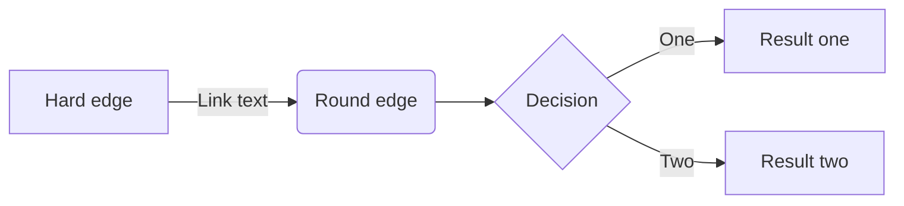
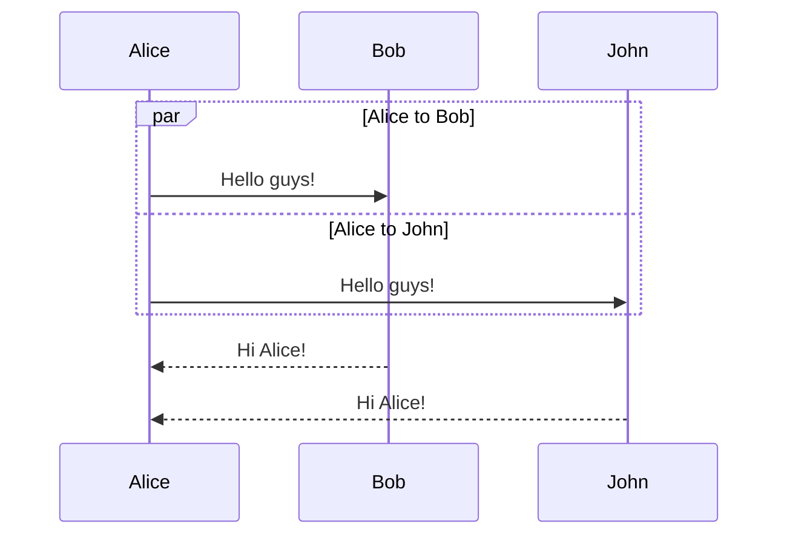
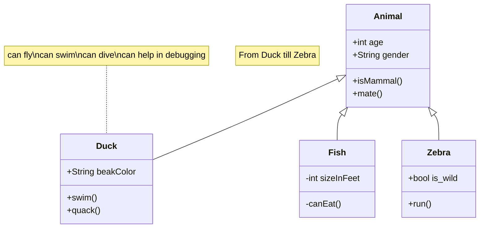
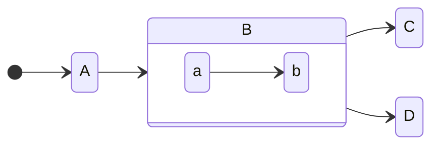
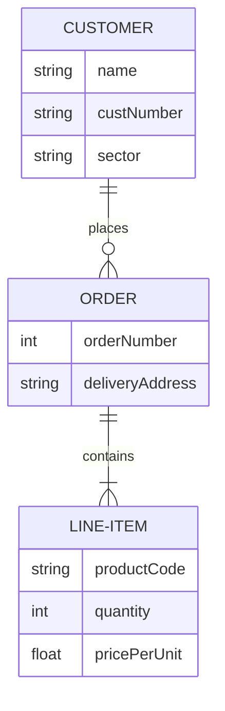
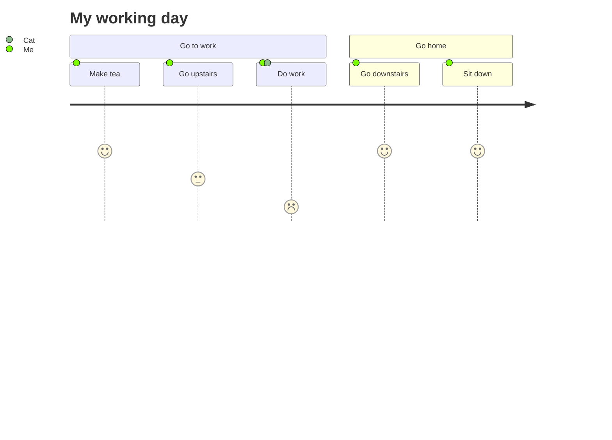
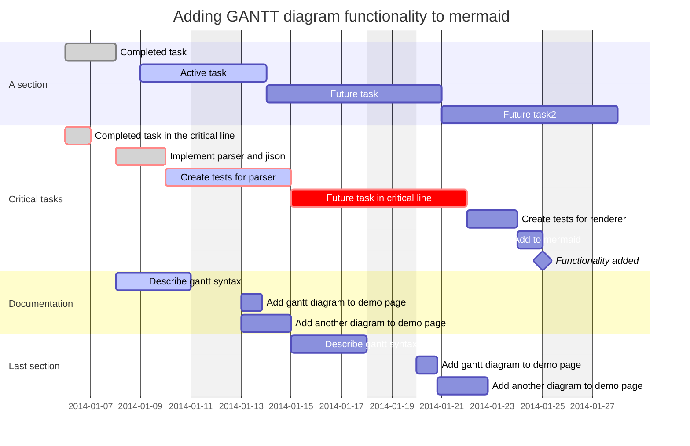
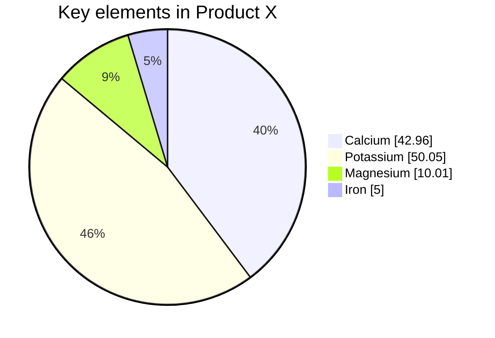
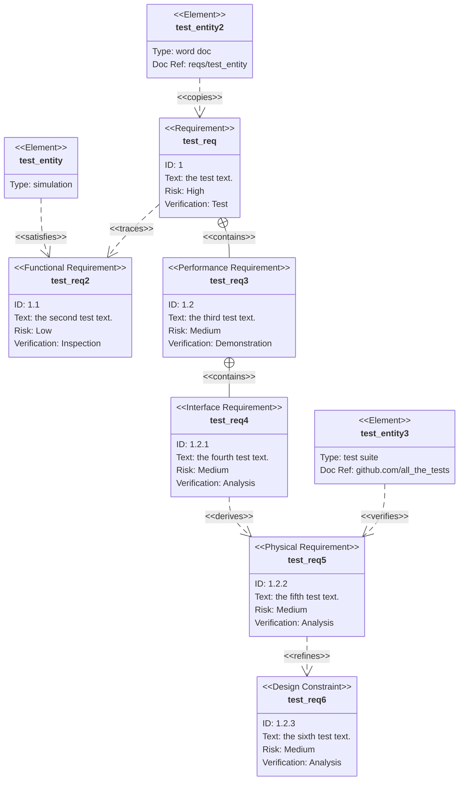
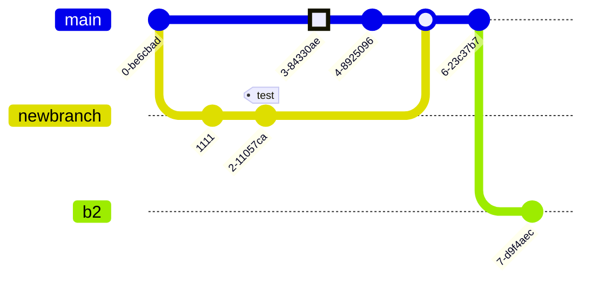

# Kitchen Sink

## Abbreviations

This template comes with a lot of built-in abbreviations. To use them just type an abbreviation, and it will be
annotated.

WCAG is a standard for accessibility from the W3C WAI.

```markdown
WCAG is a standard for accessibility from the W3C WAI.
```

If an abbreviation is missing, just add it to the [`snippets/abbreviations.md`](https://github.com/CPS-Innovation/digital-sop/blob/main/snippets/abbreviations.md?plain=1) file.

!!! warning "Only in production!"

    The abbreviations will only render when you run `mkdocs build`, they do not show with `mkdocs serve`.

## Customising Pages

Customising a page is done using [frontmatter](https://www.mkdocs.org/user-guide/writing-your-docs/#yaml-style-meta-data)
a section at the beginning of the document.

### Hiding Table of Contents

To hide the table of contents on the right of the page place the following at the top of the page.

```markdown
---
hide:
  - toc
---
```

### Hiding Navigation

To hide the table of contents on the right of the page place the following at the top of the page.

```markdown
---
hide:
  - navigation
---
```

### Changing the page title

To change a page title from the default there are two options. This will update both the level one header on the page
and how the page title is shown in the navigation panel on the left.

#### Level 1 header

Start your document off with the following.

```markdown
# Page Title
```

#### Frontmatter

Add the following frontmatter to the top of your page.

```markdown
---
title: Page Title
---
```

## Slideshows

To create a slide show, [export from PowerPoint in SVG format](https://office-watch.com/2022/save-image-slides-svg-format/#powerpoint-slides-to-svg)
and upload the resulting folder (with no spaces in the folder or slide name) the same way you would any image.

Once added to the folder structure, add the following code block to your page, noticing that the paths in the list are
relative to the root of the repository.

    ```slideshow
    docs/activities/documentation/technical-approaches/Slide1.SVG
    docs/activities/documentation/technical-approaches/Slide2.SVG
    docs/activities/documentation/technical-approaches/Slide3.SVG
    docs/activities/documentation/technical-approaches/Slide4.SVG
    docs/activities/documentation/technical-approaches/Slide5.SVG
    ```

This will result in the following component.

```slideshow
docs/activities/documentation/technical-approaches/Slide1.SVG
docs/activities/documentation/technical-approaches/Slide2.SVG
docs/activities/documentation/technical-approaches/Slide3.SVG
docs/activities/documentation/technical-approaches/Slide4.SVG
docs/activities/documentation/technical-approaches/Slide5.SVG
```

## Admonitions

### Main

!!! note "Note title"

    Lorem ipsum dolor sit amet, consectetur adipiscing elit. Nulla et euismod
    nulla. Curabitur feugiat, tortor non consequat finibus, justo purus auctor
    massa, nec semper lorem quam in massa.

```markdown
!!! note "Note title"

    Lorem ipsum dolor sit amet, consectetur adipiscing elit. Nulla et euismod
    nulla. Curabitur feugiat, tortor non consequat finibus, justo purus auctor
    massa, nec semper lorem quam in massa.
```

### Inline Left

!!! note inline

    Lorem ipsum dolor sit amet, 
    consectetur adipiscing elit.

```markdown
!!! note inline

    Lorem ipsum dolor sit amet, 
    consectetur adipiscing elit.

```


### Inline Right

!!! note inline end

    Lorem ipsum dolor sit amet, consectetur adipiscing elit.

```markdown
!!! note inline end

    Lorem ipsum dolor sit amet, 
    consectetur adipiscing elit.

```

### Supported types

#### note

!!! note

    Lorem ipsum dolor sit amet, consectetur adipiscing elit.

#### abstract

!!! abstract

    Lorem ipsum dolor sit amet, consectetur adipiscing elit.

#### info

!!! info

    Lorem ipsum dolor sit amet, consectetur adipiscing elit.

#### tip

!!! tip

    Lorem ipsum dolor sit amet, consectetur adipiscing elit.

#### success

!!! success

    Lorem ipsum dolor sit amet, consectetur adipiscing elit.

#### question

!!! question

    Lorem ipsum dolor sit amet, consectetur adipiscing elit.

#### warning

!!! warning

    Lorem ipsum dolor sit amet, consectetur adipiscing elit.

#### failure

!!! failure

    Lorem ipsum dolor sit amet, consectetur adipiscing elit.

#### danger

!!! danger

    Lorem ipsum dolor sit amet, consectetur adipiscing elit.

#### bug

!!! bug

    Lorem ipsum dolor sit amet, consectetur adipiscing elit.

#### example

!!! example

    Lorem ipsum dolor sit amet, consectetur adipiscing elit.

#### quote

!!! quote

    Lorem ipsum dolor sit amet, consectetur adipiscing elit.


## Blockquotes

> Use blockquotes to call out a vision or enhance a point

```markdown
> Use blockquotes to call out a vision or enhance a point
```

## Buttons

### External Link

[GDS Service Manual](https://www.gov.uk/service-manual){ .md-button }

```markdown
[GDS Service Manual](https://www.gov.uk/service-manual){ .md-button }
```

### Internal Link

[Discovery](../../playbooks/10-Discovery-Playbook/index.md){ .md-button .md-button--primary }

```markdown
[Discovery](../../playbooks/10-Discovery-Playbook/index.md){ .md-button .md-button--primary }
```

### Disabled Link

[Alpha](){ .md-button .md-button--disabled }

```markdown
[Alpha](){ .md-button .md-button--disabled }
```


## Keyboard Shortcuts

You can include keyboard shortcuts in your documentation using the following formatting.

To copy, press ++ctrl+c++ or ++cmd+c++

```
To copy, press ++ctrl+c++ or ++cmd+c++
```

## Definition lists

Definition lists or `dl` tags, are useful anywhere you need a list of key-value pairs.

Single line

:   Sed sagittis eleifend rutrum. Donec vitae suscipit est.

```markdown
Single line

:   Sed sagittis eleifend rutrum. Donec vitae suscipit est.
```

Multi-line

:   Aliquam metus eros, pretium sed nulla venenatis, faucibus auctor ex. Proin
    ut eros sed sapien ullamcorper consequat. Nunc ligula ante.

    Duis mollis est eget nibh volutpat, fermentum aliquet dui mollis.
    Nam vulputate tincidunt fringilla.
    Nullam dignissim ultrices urna non auctor.

```markdown
Multi-line

:   Aliquam metus eros, pretium sed nulla venenatis, faucibus auctor ex. Proin
    ut eros sed sapien ullamcorper consequat. Nunc ligula ante.

    Duis mollis est eget nibh volutpat, fermentum aliquet dui mollis.
    Nam vulputate tincidunt fringilla.
    Nullam dignissim ultrices urna non auctor.
```

## Tables

Normal Markdown tables, nothing new here.

| Resource   | Method   | Description                          |
|:-----------|:---------|:-------------------------------------|
| `/users/1` | `GET`    | :material-check:     Fetch resource  |
| `/users/1` | `PUT`    | :material-check-all: Update resource |
| `/users/1` | `DELETE` | :material-close:     Delete resource |

```markdown
| Resource   | Method   | Description                          |
|:-----------|:---------|:-------------------------------------|
| `/users/1` | `GET`    | :material-check:     Fetch resource  |
| `/users/1` | `PUT`    | :material-check-all: Update resource |
| `/users/1` | `DELETE` | :material-close:     Delete resource |
```

## Math and Latex

You can use the [MathJax](https://www.mathjax.org/) library to display both inline and centred equations, or formatted
text.

### Inline

```
Albert Einstein’s famous energy-mass equation, $E = mc^ 2$ is one of the greatest marvels of this universe.
```

Albert Einstein’s famous energy-mass equation, $E = mc^ 2$ is one of the greatest marvels of this universe.

### Centred

```
Albert Einstein’s famous energy-mass equation, is one of the greatest marvels of this universe.

$$
E = mc^ 2
$$
```

Albert Einstein’s famous energy-mass equation, is one of the greatest marvels of this universe.

$$E = mc^ 2$$

## Icons and Emojis

To include icons and emoji, use the same syntax you would on slack.

For example, `:material-account-child-outline:` produces :material-account-child-outline:.

### Available Libraries

* [Material Design Icons](https://pictogrammers.com/library/mdi/) (prefix with `:material-`)
* [Font Awesome Icons](https://fontawesome.com/search?o=r&m=free) (prefix with `:fontawesome-`)
* [Octicons](https://primer.style/design/foundations/icons) (prefix with `:octicons-`)

## PlantUML Diagrams

PlantUML diagrams use the PlantUML web service to render diagrams. They support click to zoom, allowing for more complex
diagrams.

```diagram-plantuml
@startuml
!include <C4/C4_Component>

title Component diagram for Internet Banking System - API Application

Container(spa, "Single Page Application", "javascript and angular", "Provides all the internet banking functionality to customers via their web browser.")
Container(ma, "Mobile App", "Xamarin", "Provides a limited subset ot the internet banking functionality to customers via their mobile mobile device.")
ContainerDb(db, "Database", "Relational Database Schema", "Stores user registration information, hashed authentication credentials, access logs, etc.")
System_Ext(mbs, "Mainframe Banking System", "Stores all of the core banking information about customers, accounts, transactions, etc.")

Container_Boundary(api, "API Application") {
    Component(sign, "Sign In Controller", "MVC Rest Controller", "Allows users to sign in to the internet banking system")
    Component(accounts, "Accounts Summary Controller", "MVC Rest Controller", "Provides customers with a summary of their bank accounts")
    Component(security, "Security Component", "Spring Bean", "Provides functionality related to singing in, changing passwords, etc.")
    Component(mbsfacade, "Mainframe Banking System Facade", "Spring Bean", "A facade onto the mainframe banking system.")

    Rel(sign, security, "Uses")
    Rel(accounts, mbsfacade, "Uses")
    Rel(security, db, "Read & write to", "JDBC")
    Rel(mbsfacade, mbs, "Uses", "XML/HTTPS")
}

Rel(spa, sign, "Uses", "JSON/HTTPS")
Rel(spa, accounts, "Uses", "JSON/HTTPS")

Rel(ma, sign, "Uses", "JSON/HTTPS")
Rel(ma, accounts, "Uses", "JSON/HTTPS")

SHOW_DYNAMIC_LEGEND()
@enduml
```

    ```diagram-plantuml
    @startuml
    !include <C4/C4_Component>
    
    title Component diagram for Internet Banking System - API Application
    
    Container(spa, "Single Page Application", "javascript and angular", "Provides all the internet banking functionality to customers via their web browser.")
    Container(ma, "Mobile App", "Xamarin", "Provides a limited subset ot the internet banking functionality to customers via their mobile mobile device.")
    ContainerDb(db, "Database", "Relational Database Schema", "Stores user registration information, hashed authentication credentials, access logs, etc.")
    System_Ext(mbs, "Mainframe Banking System", "Stores all of the core banking information about customers, accounts, transactions, etc.")
    
    Container_Boundary(api, "API Application") {
        Component(sign, "Sign In Controller", "MVC Rest Controller", "Allows users to sign in to the internet banking system")
        Component(accounts, "Accounts Summary Controller", "MVC Rest Controller", "Provides customers with a summary of their bank accounts")
        Component(security, "Security Component", "Spring Bean", "Provides functionality related to singing in, changing passwords, etc.")
        Component(mbsfacade, "Mainframe Banking System Facade", "Spring Bean", "A facade onto the mainframe banking system.")
    
        Rel(sign, security, "Uses")
        Rel(accounts, mbsfacade, "Uses")
        Rel(security, db, "Read & write to", "JDBC")
        Rel(mbsfacade, mbs, "Uses", "XML/HTTPS")
    }
    
    Rel(spa, sign, "Uses", "JSON/HTTPS")
    Rel(spa, accounts, "Uses", "JSON/HTTPS")
    
    Rel(ma, sign, "Uses", "JSON/HTTPS")
    Rel(ma, accounts, "Uses", "JSON/HTTPS")
    
    SHOW_DYNAMIC_LEGEND()
    @enduml
    ```

## Basic Diagrams

Basic diagramming uses the [mermaid](https://mermaid.js.org/intro/) library. This template uses version 9.4.3 and does
not support click to zoom.

### Flowchart

[Documentation](https://github.com/mermaid-js/mermaid/blob/v9.4.3/docs/syntax/flowchart.md)



    ```mermaid
    flowchart LR
        A[Hard edge] -->|Link text| B(Round edge)
        B --> C{Decision}
        C -->|One| D[Result one]
        C -->|Two| E[Result two]
    ```

### Sequence Diagram

[Documentation](https://github.com/mermaid-js/mermaid/blob/v9.4.3/docs/syntax/sequenceDiagram.md)



    ```mermaid
    sequenceDiagram
        par Alice to Bob
            Alice->>Bob: Hello guys!
        and Alice to John
            Alice->>John: Hello guys!
        end
        Bob-->>Alice: Hi Alice!
        John-->>Alice: Hi Alice!
    ```

### Class Diagram

[Documentation](https://github.com/mermaid-js/mermaid/blob/v9.4.3/docs/syntax/classDiagram.md)



    ```mermaid
    classDiagram
        note "From Duck till Zebra"
        Animal <|-- Duck
        note for Duck "can fly\ncan swim\ncan dive\ncan help in debugging"
        Animal <|-- Fish
        Animal <|-- Zebra
        Animal : +int age
        Animal : +String gender
        Animal: +isMammal()
        Animal: +mate()
        class Duck{
            +String beakColor
            +swim()
            +quack()
        }
        class Fish{
            -int sizeInFeet
            -canEat()
        }
        class Zebra{
            +bool is_wild
            +run()
        }
    ```

### State Diagram

[Documentation](https://github.com/mermaid-js/mermaid/blob/v9.4.3/docs/syntax/stateDiagram.md)



    ```mermaid
    stateDiagram
        direction LR
        [*] --> A
        A --> B
        B --> C
        state B {
          direction LR
          a --> b
        }
        B --> D
    ```

### Entity Relationship

[Documentation](https://github.com/mermaid-js/mermaid/blob/v9.4.3/docs/syntax/entityRelationshipDiagram.md)



    ```mermaid
    erDiagram
        CUSTOMER ||--o{ ORDER : places
        CUSTOMER {
            string name
            string custNumber
            string sector
        }
        ORDER ||--|{ LINE-ITEM : contains
        ORDER {
            int orderNumber
            string deliveryAddress
        }
        LINE-ITEM {
            string productCode
            int quantity
            float pricePerUnit
        }
    ```

### User Journey

[Documentation](https://github.com/mermaid-js/mermaid/blob/v9.4.3/docs/syntax/userJourney.md)



    ```mermaid
    journey
        title My working day
        section Go to work
          Make tea: 5: Me
          Go upstairs: 3: Me
          Do work: 1: Me, Cat
        section Go home
          Go downstairs: 5: Me
          Sit down: 5: Me
    ```

### Gantt

[Documentation](https://github.com/mermaid-js/mermaid/blob/v9.4.3/docs/syntax/gantt.md)



    ```mermaid
    gantt
        dateFormat  YYYY-MM-DD
        title       Adding GANTT diagram functionality to mermaid
        excludes    weekends
        %% (`excludes` accepts specific dates in YYYY-MM-DD format, days of the week ("sunday") or "weekends", but not the word "weekdays".)
    
        section A section
        Completed task            :done,    des1, 2014-01-06,2014-01-08
        Active task               :active,  des2, 2014-01-09, 3d
        Future task               :         des3, after des2, 5d
        Future task2              :         des4, after des3, 5d
    
        section Critical tasks
        Completed task in the critical line :crit, done, 2014-01-06,24h
        Implement parser and jison          :crit, done, after des1, 2d
        Create tests for parser             :crit, active, 3d
        Future task in critical line        :crit, 5d
        Create tests for renderer           :2d
        Add to mermaid                      :1d
        Functionality added                 :milestone, 2014-01-25, 0d
    
        section Documentation
        Describe gantt syntax               :active, a1, after des1, 3d
        Add gantt diagram to demo page      :after a1  , 20h
        Add another diagram to demo page    :doc1, after a1  , 48h
    
        section Last section
        Describe gantt syntax               :after doc1, 3d
        Add gantt diagram to demo page      :20h
        Add another diagram to demo page    :48h
    ```


### Pie Chart

[Documentation](https://github.com/mermaid-js/mermaid/blob/v9.4.3/docs/syntax/pie.md)



    ```mermaid
    pie showData
        title Key elements in Product X
        "Calcium" : 42.96
        "Potassium" : 50.05
        "Magnesium" : 10.01
        "Iron" :  5
    ```

### Requirement

[Documentation](https://github.com/mermaid-js/mermaid/blob/v9.4.3/docs/syntax/requirementDiagram.md)



    ```mermaid
    requirementDiagram
    
        requirement test_req {
        id: 1
        text: the test text.
        risk: high
        verifymethod: test
        }
    
        functionalRequirement test_req2 {
        id: 1.1
        text: the second test text.
        risk: low
        verifymethod: inspection
        }
    
        performanceRequirement test_req3 {
        id: 1.2
        text: the third test text.
        risk: medium
        verifymethod: demonstration
        }
    
        interfaceRequirement test_req4 {
        id: 1.2.1
        text: the fourth test text.
        risk: medium
        verifymethod: analysis
        }
    
        physicalRequirement test_req5 {
        id: 1.2.2
        text: the fifth test text.
        risk: medium
        verifymethod: analysis
        }
    
        designConstraint test_req6 {
        id: 1.2.3
        text: the sixth test text.
        risk: medium
        verifymethod: analysis
        }
    
        element test_entity {
        type: simulation
        }
    
        element test_entity2 {
        type: word doc
        docRef: reqs/test_entity
        }
    
        element test_entity3 {
        type: "test suite"
        docRef: github.com/all_the_tests
        }
    
    
        test_entity - satisfies -> test_req2
        test_req - traces -> test_req2
        test_req - contains -> test_req3
        test_req3 - contains -> test_req4
        test_req4 - derives -> test_req5
        test_req5 - refines -> test_req6
        test_entity3 - verifies -> test_req5
        test_req <- copies - test_entity2
    ```

### Git Graph

[Documentation](https://github.com/mermaid-js/mermaid/blob/v9.4.3/docs/syntax/gitgraph.md)



    ```mermaid
    gitGraph:
        commit "Ashish"
        branch newbranch
        checkout newbranch
        commit id:"1111"
        commit tag:"test"
        checkout main
        commit type: HIGHLIGHT
        commit
        merge newbranch
        commit
        branch b2
        commit
    ```
