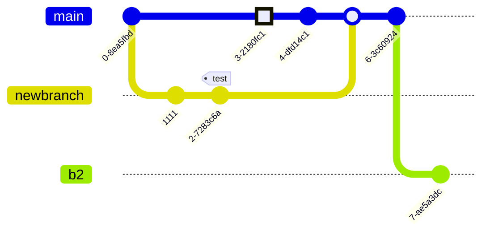

# Kitchen Sink

## Abbreviations

This template comes with a lot of built-in abbreviations. To use them just type an abbreviation, and it will be
annotated.

WCAG is a standard for accessibility from the W3C WAI.

```markdown
WCAG is a standard for accessibility from the W3C WAI.
```

If an abbreviation is missing, just add it to the [`snippets/abbreviations.md`](https://github.com/CPS-Innovation/digital-sop/blob/main/snippets/abbreviations.md?plain=1) file.

!!! warning "Only in production!"

    The abbreviations will only render when you run `mkdocs build`, they do not show with `mkdocs serve`.

## Customising Pages

Customising a page is done using [frontmatter](https://www.mkdocs.org/user-guide/writing-your-docs/#yaml-style-meta-data)
a section at the beginning of the document.

### Hiding Table of Contents

To hide the table of contents on the right of the page place the following at the top of the page.

```markdown
---
hide:
  - toc
---
```

### Hiding Navigation

To hide the table of contents on the right of the page place the following at the top of the page.

```markdown
---
hide:
  - navigation
---
```

### Changing the page title

To change a page title from the default there are two options. This will update both the level one header on the page
and how the page title is shown in the navigation panel on the left.

#### Level 1 header

Start your document off with the following.

```markdown
# Page Title
```

#### Frontmatter

Add the following frontmatter to the top of your page.

```markdown
---
title: Page Title
---
```

## Slideshows

To create a slide show, [export from PowerPoint in SVG format](https://office-watch.com/2022/save-image-slides-svg-format/#powerpoint-slides-to-svg)
and upload the resulting folder (with no spaces in the folder or slide name) the same way you would any image.

Once added to the folder structure, add the following code block to your page, noticing that the paths in the list are
relative to the root of the repository.

    ```slideshow
    docs/activities/documentation/technical-approaches/Slide1.SVG
    docs/activities/documentation/technical-approaches/Slide2.SVG
    docs/activities/documentation/technical-approaches/Slide3.SVG
    docs/activities/documentation/technical-approaches/Slide4.SVG
    docs/activities/documentation/technical-approaches/Slide5.SVG
    ```

This will result in the following component.

```slideshow
docs/activities/documentation/technical-approaches/Slide1.SVG
docs/activities/documentation/technical-approaches/Slide2.SVG
docs/activities/documentation/technical-approaches/Slide3.SVG
docs/activities/documentation/technical-approaches/Slide4.SVG
docs/activities/documentation/technical-approaches/Slide5.SVG
```

When you add a slideshow to the site, you must always add a link to download the file. To do this, place a copy of the
PowerPoint file in the same directory as the page you are updating, ensuring that the file name contains no spaces. Then
add a link under the slideshow as follows.

```markdown
[Download this slideshow](./slideshow-file.pptx)
```

## Images

You can embed uploaded images as follows. In order to ensure the accessibility of images, you **must** include 
alternative text describing the image.


```markdown

```

## Admonitions

Admonitions, also known as call-outs, are an excellent choice for including side content without significantly 
interrupting the document flow.

When using an admonition it is important to account for users with screen readers. When giving the admonition a title,
you must prefix that title with the type of admonition. 

For example when including a `warning` with a title you must use the following

!!! warning inline end "Warning: beware the pigeons!"
    
    There are many pigeons around London, watch out for them!

```markdown
!!! warning inline end "Warning: beware the pigeons!"
    
    There are many pigeons around London, watch out for them!
```

This ensures the contextual information sighted users derive from the colour and icon is also accessible to partially 
and non-sighted users.

### Main

!!! note "Note: title"

    Lorem ipsum dolor sit amet, consectetur adipiscing elit. Nulla et euismod
    nulla. Curabitur feugiat, tortor non consequat finibus, justo purus auctor
    massa, nec semper lorem quam in massa.

```markdown
!!! note "Note: title"

    Lorem ipsum dolor sit amet, consectetur adipiscing elit. Nulla et euismod
    nulla. Curabitur feugiat, tortor non consequat finibus, justo purus auctor
    massa, nec semper lorem quam in massa.
```

### Inline Left

!!! note inline

    Lorem ipsum dolor sit amet, 
    consectetur adipiscing elit.

```markdown
!!! note inline

    Lorem ipsum dolor sit amet, 
    consectetur adipiscing elit.

```


### Inline Right

!!! note inline end

    Lorem ipsum dolor sit amet, consectetur adipiscing elit.

```markdown
!!! note inline end

    Lorem ipsum dolor sit amet, 
    consectetur adipiscing elit.

```

### Supported types

#### note

!!! note

    Lorem ipsum dolor sit amet, consectetur adipiscing elit.

#### abstract

!!! abstract

    Lorem ipsum dolor sit amet, consectetur adipiscing elit.

#### info

!!! info

    Lorem ipsum dolor sit amet, consectetur adipiscing elit.

#### tip

!!! tip

    Lorem ipsum dolor sit amet, consectetur adipiscing elit.

#### success

!!! success

    Lorem ipsum dolor sit amet, consectetur adipiscing elit.

#### question

!!! question

    Lorem ipsum dolor sit amet, consectetur adipiscing elit.

#### warning

!!! warning

    Lorem ipsum dolor sit amet, consectetur adipiscing elit.

#### failure

!!! failure

    Lorem ipsum dolor sit amet, consectetur adipiscing elit.

#### danger

!!! danger

    Lorem ipsum dolor sit amet, consectetur adipiscing elit.

#### bug

!!! bug

    Lorem ipsum dolor sit amet, consectetur adipiscing elit.

#### example

!!! example

    Lorem ipsum dolor sit amet, consectetur adipiscing elit.

#### quote

!!! quote

    Lorem ipsum dolor sit amet, consectetur adipiscing elit.


## Blockquotes

> Use blockquotes to call out a vision or enhance a point

```markdown
> Use blockquotes to call out a vision or enhance a point
```

## Buttons

### External Link

[GDS Service Manual](https://www.gov.uk/service-manual){ .md-button }

```markdown
[GDS Service Manual](https://www.gov.uk/service-manual){ .md-button }
```

### Internal Link

[Discovery](../../playbooks/Lifecycle/10-Discovery-Playbook/index.md){ .md-button .md-button--primary }

```markdown
[Discovery](../../playbooks/Lifecycle/10-Discovery-Playbook/index.md){ .md-button .md-button--primary }
```

### Disabled Link

[Alpha](){ .md-button .md-button--disabled }

```markdown
[Alpha](){ .md-button .md-button--disabled }
```


## Keyboard Shortcuts

You can include keyboard shortcuts in your documentation using the following formatting.

To copy, press ++ctrl+c++ or ++cmd+c++

```
To copy, press ++ctrl+c++ or ++cmd+c++
```

## Definition lists

Definition lists or `dl` tags, are useful anywhere you need a list of key-value pairs.

Single line

:   Sed sagittis eleifend rutrum. Donec vitae suscipit est.

```markdown
Single line

:   Sed sagittis eleifend rutrum. Donec vitae suscipit est.
```

Multi-line

:   Aliquam metus eros, pretium sed nulla venenatis, faucibus auctor ex. Proin
    ut eros sed sapien ullamcorper consequat. Nunc ligula ante.

    Duis mollis est eget nibh volutpat, fermentum aliquet dui mollis.
    Nam vulputate tincidunt fringilla.
    Nullam dignissim ultrices urna non auctor.

```markdown
Multi-line

:   Aliquam metus eros, pretium sed nulla venenatis, faucibus auctor ex. Proin
    ut eros sed sapien ullamcorper consequat. Nunc ligula ante.

    Duis mollis est eget nibh volutpat, fermentum aliquet dui mollis.
    Nam vulputate tincidunt fringilla.
    Nullam dignissim ultrices urna non auctor.
```

## Tables

Normal Markdown tables, nothing new here.

| Resource   | Method   | Description                          |
|:-----------|:---------|:-------------------------------------|
| `/users/1` | `GET`    | :material-check:     Fetch resource  |
| `/users/1` | `PUT`    | :material-check-all: Update resource |
| `/users/1` | `DELETE` | :material-close:     Delete resource |

```markdown
| Resource   | Method   | Description                          |
|:-----------|:---------|:-------------------------------------|
| `/users/1` | `GET`    | :material-check:     Fetch resource  |
| `/users/1` | `PUT`    | :material-check-all: Update resource |
| `/users/1` | `DELETE` | :material-close:     Delete resource |
```

## Math and Latex

You can use the [MathJax](https://www.mathjax.org/) library to display both inline and centred equations, or formatted
text.

### Inline

```
Albert Einstein’s famous energy-mass equation, $E = mc^ 2$ is one of the greatest marvels of this universe.
```

Albert Einstein’s famous energy-mass equation, $E = mc^ 2$ is one of the greatest marvels of this universe.

### Centred

```
Albert Einstein’s famous energy-mass equation, is one of the greatest marvels of this universe.

$$
E = mc^ 2
$$
```

Albert Einstein’s famous energy-mass equation, is one of the greatest marvels of this universe.

$$E = mc^ 2$$

## Icons and Emojis

To include icons and emoji, use the same syntax you would on slack.

For example, `:material-account-child-outline:{ alt="Icon: Parent and Child" }` produces 
:material-account-child-outline:{ alt="Icon: Parent and Child" }. It is crucial to add the alternative text after the 
icon to allow those using screen-readers to understand the meaning or context of the icon. You may omit the alternative
text only when the meaning is clear from the icon code, for example `Supported? :material-check: Yes` will produce 
"Supported? :material-check: Yes", the alt text being `Icon: check`.

### Available Libraries 

* [Material Design Icons](https://pictogrammers.com/library/mdi/) (prefix with `:material-`)
* [Font Awesome Icons](https://fontawesome.com/search?o=r&m=free) (prefix with `:fontawesome-`)
* [Octicons](https://primer.style/design/foundations/icons) (prefix with `:octicons-`)

## PlantUML Diagrams

PlantUML diagrams use the PlantUML web service to render diagrams. They support click to zoom, allowing for more complex
diagrams.

While diagramming is important, you must not forget colleagues with visual impairments. **All diagrams must be 
accompanied by a description sufficient to understand the contents.** If allowed, generative AI tools like ChatGPT can
create a text description of any diagram by asking the following: "Create a text description of the following plantuml 
diagram: `<paste diagram code here>`", the resulting description can then be included under the diagram.

[Skip to Diagram Description](#c4_component_description)

```diagram-plantuml
@startuml
!include <C4/C4_Component>

title Component diagram for Internet Banking System - API Application

Container(spa, "Single Page Application", "javascript and angular", "Provides all the internet banking functionality to customers via their web browser.")
Container(ma, "Mobile App", "Xamarin", "Provides a limited subset ot the internet banking functionality to customers via their mobile mobile device.")
ContainerDb(db, "Database", "Relational Database Schema", "Stores user registration information, hashed authentication credentials, access logs, etc.")
System_Ext(mbs, "Mainframe Banking System", "Stores all of the core banking information about customers, accounts, transactions, etc.")

Container_Boundary(api, "API Application") {
    Component(sign, "Sign In Controller", "MVC Rest Controller", "Allows users to sign in to the internet banking system")
    Component(accounts, "Accounts Summary Controller", "MVC Rest Controller", "Provides customers with a summary of their bank accounts")
    Component(security, "Security Component", "Spring Bean", "Provides functionality related to singing in, changing passwords, etc.")
    Component(mbsfacade, "Mainframe Banking System Facade", "Spring Bean", "A facade onto the mainframe banking system.")

    Rel(sign, security, "Uses")
    Rel(accounts, mbsfacade, "Uses")
    Rel(security, db, "Read & write to", "JDBC")
    Rel(mbsfacade, mbs, "Uses", "XML/HTTPS")
}

Rel(spa, sign, "Uses", "JSON/HTTPS")
Rel(spa, accounts, "Uses", "JSON/HTTPS")

Rel(ma, sign, "Uses", "JSON/HTTPS")
Rel(ma, accounts, "Uses", "JSON/HTTPS")

SHOW_DYNAMIC_LEGEND()
@enduml
```


??? info "Info: System Context diagram description"

    <a id="c4_component_description"></a>
    This PlantUML diagram represents a "Component diagram for Internet Banking System - API Application." The diagram illustrates the components and their interactions within the API Application that forms part of the Internet Banking System. Let's break down the elements of the diagram:

    Title: "Component diagram for Internet Banking System - API Application"
    
    Containers:

    1. Container: Represented as "Single Page Application (SPA)." This container is implemented using JavaScript and Angular and provides all the internet banking functionality to customers via their web browsers.
    2. Container: Represented as "Mobile App (MA)." This container is implemented using Xamarin and provides a limited subset of the internet banking functionality to customers via their mobile devices.
    3. ContainerDb: Represented as "Database." This container represents the Relational Database Schema and stores user registration information, hashed authentication credentials, access logs, etc.
    4. System_Ext: Represented as "Mainframe Banking System (MBS)." This external system stores all the core banking information about customers, accounts, transactions, etc.
    
    Container Boundary:
    The "API Application" is a boundary that groups related components within it.
    
    Components:

    1. Component: Represented as "Sign In Controller." This MVC Rest Controller component allows users to sign in to the internet banking system.
    2. Component: Represented as "Accounts Summary Controller." This MVC Rest Controller component provides customers with a summary of their bank accounts.
    3. Component: Represented as "Security Component." This Spring Bean component provides functionality related to signing in, changing passwords, etc.
    4. Component: Represented as "Mainframe Banking System Facade." This Spring Bean component serves as a facade onto the mainframe banking system.
    
    Relationships:

    1. The "Sign In Controller" component uses the "Security Component."
    2. The "Accounts Summary Controller" component uses the "Mainframe Banking System Facade."
    3. The "Security Component" component reads and writes to the "Database" using JDBC (Java Database Connectivity).
    4. The "Mainframe Banking System Facade" component uses the "Mainframe Banking System" through XML/HTTPS communication.
    
    Additional Relationships:

    1. The "Single Page Application (SPA)" uses the "Sign In Controller" and "Accounts Summary Controller" components through JSON/HTTPS communication.
    2. The "Mobile App (MA)" uses the "Sign In Controller" and "Accounts Summary Controller" components through JSON/HTTPS communication.
    
    Overall, this Component diagram showcases the API Application's architecture for the Internet Banking System. It illustrates how the Single Page Application (SPA) and Mobile App (MA) interact with the Sign In Controller and Accounts Summary Controller, which in turn communicate with the Security Component and the Mainframe Banking System Facade to provide various banking functionalities to the end-users. Additionally, the diagram highlights the interaction of these components with the underlying Database and the Mainframe Banking System.

The following code was used to produce the above diagram and description.

    [Skip to Diagram Description](#c4_component_description)
    
    ```diagram-plantuml
    @startuml
    !include <C4/C4_Component>
    
    title Component diagram for Internet Banking System - API Application
    
    Container(spa, "Single Page Application", "javascript and angular", "Provides all the internet banking functionality to customers via their web browser.")
    Container(ma, "Mobile App", "Xamarin", "Provides a limited subset ot the internet banking functionality to customers via their mobile mobile device.")
    ContainerDb(db, "Database", "Relational Database Schema", "Stores user registration information, hashed authentication credentials, access logs, etc.")
    System_Ext(mbs, "Mainframe Banking System", "Stores all of the core banking information about customers, accounts, transactions, etc.")
    
    Container_Boundary(api, "API Application") {
        Component(sign, "Sign In Controller", "MVC Rest Controller", "Allows users to sign in to the internet banking system")
        Component(accounts, "Accounts Summary Controller", "MVC Rest Controller", "Provides customers with a summary of their bank accounts")
        Component(security, "Security Component", "Spring Bean", "Provides functionality related to singing in, changing passwords, etc.")
        Component(mbsfacade, "Mainframe Banking System Facade", "Spring Bean", "A facade onto the mainframe banking system.")
    
        Rel(sign, security, "Uses")
        Rel(accounts, mbsfacade, "Uses")
        Rel(security, db, "Read & write to", "JDBC")
        Rel(mbsfacade, mbs, "Uses", "XML/HTTPS")
    }
    
    Rel(spa, sign, "Uses", "JSON/HTTPS")
    Rel(spa, accounts, "Uses", "JSON/HTTPS")
    
    Rel(ma, sign, "Uses", "JSON/HTTPS")
    Rel(ma, accounts, "Uses", "JSON/HTTPS")
    
    SHOW_DYNAMIC_LEGEND()
    @enduml
    ```

    ??? info "Info: System Context diagram description"

        <a id="c4_component_description"></a>
        This PlantUML diagram represents a "Component diagram for Internet Banking System - API Application." The diagram illustrates the components and their interactions within the API Application that forms part of the Internet Banking System. Let's break down the elements of the diagram:
    
        Title: "Component diagram for Internet Banking System - API Application"
        
        Containers:

        1. Container: Represented as "Single Page Application (SPA)." This container is implemented using JavaScript and Angular and provides all the internet banking functionality to customers via their web browsers.
        2. Container: Represented as "Mobile App (MA)." This container is implemented using Xamarin and provides a limited subset of the internet banking functionality to customers via their mobile devices.
        3. ContainerDb: Represented as "Database." This container represents the Relational Database Schema and stores user registration information, hashed authentication credentials, access logs, etc.
        4. System_Ext: Represented as "Mainframe Banking System (MBS)." This external system stores all the core banking information about customers, accounts, transactions, etc.
        
        Container Boundary:
        The "API Application" is a boundary that groups related components within it.
        
        Components:

        1. Component: Represented as "Sign In Controller." This MVC Rest Controller component allows users to sign in to the internet banking system.
        2. Component: Represented as "Accounts Summary Controller." This MVC Rest Controller component provides customers with a summary of their bank accounts.
        3. Component: Represented as "Security Component." This Spring Bean component provides functionality related to signing in, changing passwords, etc.
        4. Component: Represented as "Mainframe Banking System Facade." This Spring Bean component serves as a facade onto the mainframe banking system.
        
        Relationships:

        1. The "Sign In Controller" component uses the "Security Component."
        2. The "Accounts Summary Controller" component uses the "Mainframe Banking System Facade."
        3. The "Security Component" component reads and writes to the "Database" using JDBC (Java Database Connectivity).
        4. The "Mainframe Banking System Facade" component uses the "Mainframe Banking System" through XML/HTTPS communication.
        
        Additional Relationships:

        1. The "Single Page Application (SPA)" uses the "Sign In Controller" and "Accounts Summary Controller" components through JSON/HTTPS communication.
        2. The "Mobile App (MA)" uses the "Sign In Controller" and "Accounts Summary Controller" components through JSON/HTTPS communication.
        
        Overall, this Component diagram showcases the API Application's architecture for the Internet Banking System. It illustrates how the Single Page Application (SPA) and Mobile App (MA) interact with the Sign In Controller and Accounts Summary Controller, which in turn communicate with the Security Component and the Mainframe Banking System Facade to provide various banking functionalities to the end-users. Additionally, the diagram highlights the interaction of these components with the underlying Database and the Mainframe Banking System.


## Basic Diagrams

Basic diagramming uses the [mermaid](https://mermaid.js.org/intro/) library. This template uses version 9.4.3 and does
not support click to zoom.

### Flowchart

[Documentation](https://github.com/mermaid-js/mermaid/blob/v9.4.3/docs/syntax/flowchart.md)


??? info "Info: Flowchart description"
    
    The flowchart describes a process flow starting from "Hard edge" (A), which links to "Round edge" (B) with the label 
    "Link text." From node B, the process proceeds to the "Decision" (C). Based on the decision's outcome, the process 
    can take one of two paths: either "One" (C --> D) leading to "Result one" (D) or "Two" (C --> E) leading to "Result 
    two" (E). The decision node (C) allows the process to diverge into different paths depending on the conditions 
    specified by the "One" and "Two" transitions.

The above diagram and description can be created with the following code.

    ```mermaid
    flowchart LR
        A[Hard edge] -->|Link text| B(Round edge)
        B --> C{Decision}
        C -->|One| D[Result one]
        C -->|Two| E[Result two]
    ```

    ??? info "Info: Flowchart description"
        
        The flowchart describes a process flow starting from "Hard edge" (A), which links to "Round edge" (B) with the label 
        "Link text." From node B, the process proceeds to the "Decision" (C). Based on the decision's outcome, the process 
        can take one of two paths: either "One" (C --> D) leading to "Result one" (D) or "Two" (C --> E) leading to "Result 
        two" (E). The decision node (C) allows the process to diverge into different paths depending on the conditions 
        specified by the "One" and "Two" transitions.


### Sequence Diagram

[Documentation](https://github.com/mermaid-js/mermaid/blob/v9.4.3/docs/syntax/sequenceDiagram.md)


??? info "Info: Sequence diagram description"
    
    The sequence diagram shows that Alice initiates two separate interactions, one with Bob and another with John, by 
    sending the message "Hello guys!" to both of them simultaneously. Then, both Bob and John respond to Alice's message 
    with "Hi Alice!" This diagram visually represents the communication flow and parallel interactions between the 
    participants in the scenario.

The above diagram and description can be created with the following code.

    ```mermaid
    sequenceDiagram
        par Alice to Bob
            Alice->>Bob: Hello guys!
        and Alice to John
            Alice->>John: Hello guys!
        end
        Bob-->>Alice: Hi Alice!
        John-->>Alice: Hi Alice!
    ```

    ??? info "Info: Sequence diagram description"
        
        The sequence diagram shows that Alice initiates two separate interactions, one with Bob and another with John, by 
        sending the message "Hello guys!" to both of them simultaneously. Then, both Bob and John respond to Alice's message 
        with "Hi Alice!" This diagram visually represents the communication flow and parallel interactions between the 
        participants in the scenario.


### Class Diagram

[Documentation](https://github.com/mermaid-js/mermaid/blob/v9.4.3/docs/syntax/classDiagram.md)


??? info "Info: Class Diagram description"

    This class diagram represents an inheritance hierarchy and some properties and methods of various classes related to 
    animals. Let's break down the class diagram step by step:
    
    Note: The diagram begins with a note "From Duck till Zebra," providing an additional description or context for the 
    classes in the diagram.
    
    Inheritance Relationships: The diagram depicts inheritance relationships using the "<|--" arrow. It shows that the 
    classes "Duck," "Fish," and "Zebra" inherit from the base class "Animal."
    
    Note for Duck: A note is attached to the "Duck" class with additional information about the class. It states that a 
    Duck can fly, swim, dive, and even help in debugging (humorous note).
    
    Properties and Methods of Animal: The "Animal" class defines several properties and methods that are inherited by 
    its subclasses:
    
    The "Animal" class has an integer property "age" and a String property "gender." It has two methods, "isMammal()" 
    and "mate()". 

    Properties and Methods of Duck: The "Duck" class adds specific properties and methods to its instances:
    
    It has a String property "beakColor.". It has two methods, "swim()" and "quack()".

    Properties and Methods of Fish: The "Fish" class has a private integer property "sizeInFeet," which indicates the 
    size of the fish in feet. It also has a method "canEat()".
    
    Properties and Methods of Zebra: The "Zebra" class adds specific properties and methods to its instances:
    
    It has a Boolean property "is_wild," indicating whether the zebra is wild or not. It has a method "run()".

    In summary, this class diagram illustrates an inheritance hierarchy where "Duck," "Fish," and "Zebra" are subclasses 
    of the "Animal" base class. Each subclass has its own unique properties and methods, and the "Animal" class provides 
    common properties and methods that are inherited by its subclasses. Additionally, there is a note providing some 
    contextual information about the "Duck" class.

The above diagram and description can be created with the following code.

    ```mermaid
    classDiagram
        note "From Duck till Zebra"
        Animal <|-- Duck
        note for Duck "can fly\ncan swim\ncan dive\ncan help in debugging"
        Animal <|-- Fish
        Animal <|-- Zebra
        Animal : +int age
        Animal : +String gender
        Animal: +isMammal()
        Animal: +mate()
        class Duck{
            +String beakColor
            +swim()
            +quack()
        }
        class Fish{
            -int sizeInFeet
            -canEat()
        }
        class Zebra{
            +bool is_wild
            +run()
        }
    ```

    ??? info "Info: Class Diagram description"
    
        This class diagram represents an inheritance hierarchy and some properties and methods of various classes related to 
        animals. Let's break down the class diagram step by step:
        
        Note: The diagram begins with a note "From Duck till Zebra," providing an additional description or context for the 
        classes in the diagram.
        
        Inheritance Relationships: The diagram depicts inheritance relationships using the "<|--" arrow. It shows that the 
        classes "Duck," "Fish," and "Zebra" inherit from the base class "Animal."
        
        Note for Duck: A note is attached to the "Duck" class with additional information about the class. It states that a 
        Duck can fly, swim, dive, and even help in debugging (humorous note).
        
        Properties and Methods of Animal: The "Animal" class defines several properties and methods that are inherited by 
        its subclasses:
        
        The "Animal" class has an integer property "age" and a String property "gender." It has two methods, "isMammal()" 
        and "mate()". 
    
        Properties and Methods of Duck: The "Duck" class adds specific properties and methods to its instances:
        
        It has a String property "beakColor.". It has two methods, "swim()" and "quack()".
    
        Properties and Methods of Fish: The "Fish" class has a private integer property "sizeInFeet," which indicates the 
        size of the fish in feet. It also has a method "canEat()".
        
        Properties and Methods of Zebra: The "Zebra" class adds specific properties and methods to its instances:
        
        It has a Boolean property "is_wild," indicating whether the zebra is wild or not. It has a method "run()".
    
        In summary, this class diagram illustrates an inheritance hierarchy where "Duck," "Fish," and "Zebra" are subclasses 
        of the "Animal" base class. Each subclass has its own unique properties and methods, and the "Animal" class provides 
        common properties and methods that are inherited by its subclasses. Additionally, there is a note providing some 
        contextual information about the "Duck" class.

### State Diagram

[Documentation](https://github.com/mermaid-js/mermaid/blob/v9.4.3/docs/syntax/stateDiagram.md)


??? info "Info: State diagram description"

    This state diagram represents a sequence of state transitions. It starts from an unnamed initial state, goes through 
    states A, B, and C, and finally reaches state D. State B is a composite state with two sub-states "a" and "b," and 
    there is a transition from "a" to "b" within state B.


The above diagram and description can be created with the following code.

    ```mermaid
    stateDiagram
        direction LR
        [*] --> A
        A --> B
        B --> C
        state B {
          direction LR
          a --> b
        }
        B --> D
    ```

    ??? info "Info: State diagram description"

        This state diagram represents a sequence of state transitions. It starts from an unnamed initial state, goes through 
        states A, B, and C, and finally reaches state D. State B is a composite state with two sub-states "a" and "b," and 
        there is a transition from "a" to "b" within state B.

### Entity Relationship

[Documentation](https://github.com/mermaid-js/mermaid/blob/v9.4.3/docs/syntax/entityRelationshipDiagram.md)


??? info "Info: Entity Relationship Diagram description"

    This Mermaid Entity-Relationship (ER) diagram depicts a simple database schema with three entities: CUSTOMER, ORDER, 
    and LINE-ITEM. The diagram represents the relationships between these entities and their attributes. 

    Let's break down the diagram step by step:

    Entity CUSTOMER: The "CUSTOMER" entity is represented with its name enclosed in double vertical bars (||). 
    
    It has three attributes:

    * "name" of type string, representing the customer's name.
    * "custNumber" of type string, representing the customer number.
    * "sector" of type string, representing the sector to which the customer belongs.

    Entity ORDER: The "ORDER" entity is represented with its name enclosed in double vertical bars (||). 

    It has two attributes:

    * "orderNumber" of type integer, representing the unique order number.
    * "deliveryAddress" of type string, representing the delivery address for the order.

    Relationship between CUSTOMER and ORDER: The diagram shows a one-to-many (1:N) relationship between the CUSTOMER and 
    ORDER entities. The relationship is represented with an "o" and a curly brace "{". This means that one CUSTOMER can 
    place multiple (many) ORDERs.

    Entity LINE-ITEM: The "LINE-ITEM" entity is represented with its name enclosed in double vertical bars (||). 
    
    It has three attributes:

    * "productCode" of type string, representing the product code for the item in the order.
    * "quantity" of type integer, representing the quantity of the product in the order.
    * "pricePerUnit" of type float, representing the price per unit of the product.

    Relationship between ORDER and LINE-ITEM: The diagram shows a one-to-many (1:N) relationship between the ORDER and 
    LINE-ITEM entities. The relationship is represented with a single vertical bar "|" and a curly brace "{". This means 
    that one ORDER can contain multiple (many) LINE-ITEMs.
    
    In summary, this Entity-Relationship diagram illustrates a database schema with three entities: CUSTOMER, ORDER, and 
    LINE-ITEM. It shows the relationships between these entities, where one CUSTOMER can place multiple orders 
    (one-to-many), and each ORDER can contain multiple line items (one-to-many). The attributes for each entity 
    represent the data associated with the corresponding entity instances in the database.

The above diagram and description can be created with the following code.

    ```mermaid
    erDiagram
        CUSTOMER ||--o{ ORDER : places
        CUSTOMER {
            string name
            string custNumber
            string sector
        }
        ORDER ||--|{ LINE-ITEM : contains
        ORDER {
            int orderNumber
            string deliveryAddress
        }
        LINE-ITEM {
            string productCode
            int quantity
            float pricePerUnit
        }
    ```

    ??? info "Info: Entity Relationship Diagram description"
    
        This Mermaid Entity-Relationship (ER) diagram depicts a simple database schema with three entities: CUSTOMER, ORDER, 
        and LINE-ITEM. The diagram represents the relationships between these entities and their attributes. 
    
        Let's break down the diagram step by step:
    
        Entity CUSTOMER: The "CUSTOMER" entity is represented with its name enclosed in double vertical bars (||). 
        
        It has three attributes:
    
        * "name" of type string, representing the customer's name.
        * "custNumber" of type string, representing the customer number.
        * "sector" of type string, representing the sector to which the customer belongs.
    
        Entity ORDER: The "ORDER" entity is represented with its name enclosed in double vertical bars (||). 
    
        It has two attributes:
    
        * "orderNumber" of type integer, representing the unique order number.
        * "deliveryAddress" of type string, representing the delivery address for the order.
    
        Relationship between CUSTOMER and ORDER: The diagram shows a one-to-many (1:N) relationship between the CUSTOMER and 
        ORDER entities. The relationship is represented with an "o" and a curly brace "{". This means that one CUSTOMER can 
        place multiple (many) ORDERs.
    
        Entity LINE-ITEM: The "LINE-ITEM" entity is represented with its name enclosed in double vertical bars (||). 
        
        It has three attributes:
    
        * "productCode" of type string, representing the product code for the item in the order.
        * "quantity" of type integer, representing the quantity of the product in the order.
        * "pricePerUnit" of type float, representing the price per unit of the product.
    
        Relationship between ORDER and LINE-ITEM: The diagram shows a one-to-many (1:N) relationship between the ORDER and 
        LINE-ITEM entities. The relationship is represented with a single vertical bar "|" and a curly brace "{". This means 
        that one ORDER can contain multiple (many) LINE-ITEMs.
        
        In summary, this Entity-Relationship diagram illustrates a database schema with three entities: CUSTOMER, ORDER, and 
        LINE-ITEM. It shows the relationships between these entities, where one CUSTOMER can place multiple orders 
        (one-to-many), and each ORDER can contain multiple line items (one-to-many). The attributes for each entity 
        represent the data associated with the corresponding entity instances in the database.

### User Journey

[Documentation](https://github.com/mermaid-js/mermaid/blob/v9.4.3/docs/syntax/userJourney.md)


??? info "Info: User Journey Diagram Description"

    This user journey diagram depicts the user's emotions throughout their working day, which includes going to work and returning home. The diagram illustrates the user's mood after completing each activity, with a scale from 1 (unhappy) to 5 (happy). Let's break down the user journey step by step:

    Title: The diagram is titled "My working day," indicating that it represents the user's emotional journey during a typical workday.

    Section "Go to work": This section outlines the steps involved in the user's journey to work and their corresponding moods after each activity. The steps and moods are as follows:
    
    1. "Make tea": After making tea, the user ("Me") feels happy with a mood score of 5.
    2. "Go upstairs": After going upstairs, the user's mood is moderate with a score of 3, implying a neutral or somewhat neutral emotional state.
    3. "Do work": After doing work, both the user ("Me") and their cat ("Cat") feel unhappy with a mood score of 1.

    Section "Go home": This section describes the user's journey back home after work and their moods after each activity. The steps and moods are as follows:

    1. "Go downstairs": After going downstairs, the user ("Me") feels happy with a mood score of 5.
    2. "Sit down": After sitting down, the user ("Me") continues to feel happy with a mood score of 5.

    In summary, the user journey diagram represents the user's emotional state throughout their working day, considering their mood after completing each activity. It shows that the user starts the day on a positive note (making tea and going upstairs), but their mood declines while doing work (both for the user and their cat). However, the user's mood improves significantly after returning home, feeling happy when going downstairs and sitting down. The diagram provides insight into the user's emotional experiences during their daily routine.

The above diagram and description can be created with the following code. The description was generated by ChatGPT using
the following prompt: "Create a text description of the following mermaid user journey diagram, the numbers after each 
activity represent the users mood, 1 being unhappy and 5 being happy. `<diagram code>`". The prompt needed additional
context so the generated text appropriately describes the user and their cats mood.

    ```mermaid
    journey
        title My working day
        section Go to work
          Make tea: 5: Me
          Go upstairs: 3: Me
          Do work: 1: Me, Cat
        section Go home
          Go downstairs: 5: Me
          Sit down: 5: Me
    ```

    ??? info "Info: User Journey Diagram Description"
    
        This user journey diagram depicts the user's emotions throughout their working day, which includes going to work and returning home. The diagram illustrates the user's mood after completing each activity, with a scale from 1 (unhappy) to 5 (happy). Let's break down the user journey step by step:
    
        Title: The diagram is titled "My working day," indicating that it represents the user's emotional journey during a typical workday.
    
        Section "Go to work": This section outlines the steps involved in the user's journey to work and their corresponding moods after each activity. The steps and moods are as follows:
        
        1. "Make tea": After making tea, the user ("Me") feels happy with a mood score of 5.
        2. "Go upstairs": After going upstairs, the user's mood is moderate with a score of 3, implying a neutral or somewhat neutral emotional state.
        3. "Do work": After doing work, both the user ("Me") and their cat ("Cat") feel unhappy with a mood score of 1.
    
        Section "Go home": This section describes the user's journey back home after work and their moods after each activity. The steps and moods are as follows:
    
        1. "Go downstairs": After going downstairs, the user ("Me") feels happy with a mood score of 5.
        2. "Sit down": After sitting down, the user ("Me") continues to feel happy with a mood score of 5.
    
        In summary, the user journey diagram represents the user's emotional state throughout their working day, considering their mood after completing each activity. It shows that the user starts the day on a positive note (making tea and going upstairs), but their mood declines while doing work (both for the user and their cat). However, the user's mood improves significantly after returning home, feeling happy when going downstairs and sitting down. The diagram provides insight into the user's emotional experiences during their daily routine.


### Gantt

[Documentation](https://github.com/mermaid-js/mermaid/blob/v9.4.3/docs/syntax/gantt.md)


??? info "Info: Gantt Chart description"

    This Gantt chart represents a project's timeline and progress in a visual manner. It is divided into several sections, each containing various tasks and their durations. Let's break down the Gantt chart step by step:

    Title: The Gantt chart is titled "Adding GANTT diagram functionality to mermaid," indicating the purpose of the project.

    Date Format: The date format used in the chart is YYYY-MM-DD.

    Excludes Weekends: The chart excludes weekends from the timeline; it does not consider Saturdays and Sundays for task durations.

    Section "A section": This section contains tasks related to a specific phase of the project. The tasks and their durations are as follows:

    * "Completed task": This task was completed and took place from 2014-01-06 to 2014-01-08.
    * "Active task": This task is currently in progress and started on 2014-01-09. It is scheduled to take 3 days to complete.
    * "Future task": This task is planned to start after "Active task" (des2) and is estimated to take 5 days to complete.
    * "Future task2": This task is planned to start after "Future task" (des3) and is also estimated to take 5 days to complete.

    Section "Critical tasks": This section focuses on critical tasks of the project. The tasks and their durations are as follows:

    * "Completed task in the critical line": This critical task was completed within 24 hours on 2014-01-06.
    * "Implement parser and jison": This critical task was completed after "Completed task" (des1) and took 2 days to finish.
    * "Create tests for parser": This critical task is currently active and is scheduled to take 3 days to complete.
    * "Future task in critical line": This critical task is planned to take 5 days and will start after the "Create tests for parser" task.
    * "Create tests for renderer": This critical task is estimated to take 2 days.
    * "Add to mermaid": This critical task is estimated to take 1 day.
    * "Functionality added": This critical milestone marks the completion of the project, scheduled on 2014-01-25.

    Section "Documentation": This section contains tasks related to documenting the project. The tasks and their durations are as follows:

    * "Describe gantt syntax": This task is currently active and started after "Completed task" (des1). It is estimated to take 3 days.
    * "Add gantt diagram to demo page": This task is planned to start after "Describe gantt syntax" (a1) and will take 20 hours.
    * "Add another diagram to demo page": This task is planned to start after "Add gantt diagram to demo page" and will take 48 hours.

    Section "Last section": This section contains additional tasks and their durations. The tasks are as follows:

    * "Describe gantt syntax": This task is planned to start after "Add another diagram to demo page" and will take 3 days.
    * "Add gantt diagram to demo page": This task is estimated to take 20 hours.
    * "Add another diagram to demo page": This task is estimated to take 48 hours.
    
    Overall, this Gantt chart visually represents the project's timeline, with different sections for various phases of the project and tasks with their corresponding durations and progress. It provides an overview of the project's schedule and critical tasks.

The above diagram and description can be created with the following code.

    ```mermaid
    gantt
        dateFormat  YYYY-MM-DD
        title       Adding GANTT diagram functionality to mermaid
        excludes    weekends
        %% (`excludes` accepts specific dates in YYYY-MM-DD format, days of the week ("sunday") or "weekends", but not the word "weekdays".)
    
        section A section
        Completed task            :done,    des1, 2014-01-06,2014-01-08
        Active task               :active,  des2, 2014-01-09, 3d
        Future task               :         des3, after des2, 5d
        Future task2              :         des4, after des3, 5d
    
        section Critical tasks
        Completed task in the critical line :crit, done, 2014-01-06,24h
        Implement parser and jison          :crit, done, after des1, 2d
        Create tests for parser             :crit, active, 3d
        Future task in critical line        :crit, 5d
        Create tests for renderer           :2d
        Add to mermaid                      :1d
        Functionality added                 :milestone, 2014-01-25, 0d
    
        section Documentation
        Describe gantt syntax               :active, a1, after des1, 3d
        Add gantt diagram to demo page      :after a1  , 20h
        Add another diagram to demo page    :doc1, after a1  , 48h
    
        section Last section
        Describe gantt syntax               :after doc1, 3d
        Add gantt diagram to demo page      :20h
        Add another diagram to demo page    :48h
    ```

    ??? info "Info: Gantt Chart description"
    
        This Gantt chart represents a project's timeline and progress in a visual manner. It is divided into several sections, each containing various tasks and their durations. Let's break down the Gantt chart step by step:
    
        Title: The Gantt chart is titled "Adding GANTT diagram functionality to mermaid," indicating the purpose of the project.
    
        Date Format: The date format used in the chart is YYYY-MM-DD.
    
        Excludes Weekends: The chart excludes weekends from the timeline; it does not consider Saturdays and Sundays for task durations.
    
        Section "A section": This section contains tasks related to a specific phase of the project. The tasks and their durations are as follows:
    
        * "Completed task": This task was completed and took place from 2014-01-06 to 2014-01-08.
        * "Active task": This task is currently in progress and started on 2014-01-09. It is scheduled to take 3 days to complete.
        * "Future task": This task is planned to start after "Active task" (des2) and is estimated to take 5 days to complete.
        * "Future task2": This task is planned to start after "Future task" (des3) and is also estimated to take 5 days to complete.
    
        Section "Critical tasks": This section focuses on critical tasks of the project. The tasks and their durations are as follows:
    
        * "Completed task in the critical line": This critical task was completed within 24 hours on 2014-01-06.
        * "Implement parser and jison": This critical task was completed after "Completed task" (des1) and took 2 days to finish.
        * "Create tests for parser": This critical task is currently active and is scheduled to take 3 days to complete.
        * "Future task in critical line": This critical task is planned to take 5 days and will start after the "Create tests for parser" task.
        * "Create tests for renderer": This critical task is estimated to take 2 days.
        * "Add to mermaid": This critical task is estimated to take 1 day.
        * "Functionality added": This critical milestone marks the completion of the project, scheduled on 2014-01-25.
    
        Section "Documentation": This section contains tasks related to documenting the project. The tasks and their durations are as follows:
    
        * "Describe gantt syntax": This task is currently active and started after "Completed task" (des1). It is estimated to take 3 days.
        * "Add gantt diagram to demo page": This task is planned to start after "Describe gantt syntax" (a1) and will take 20 hours.
        * "Add another diagram to demo page": This task is planned to start after "Add gantt diagram to demo page" and will take 48 hours.
    
        Section "Last section": This section contains additional tasks and their durations. The tasks are as follows:
    
        * "Describe gantt syntax": This task is planned to start after "Add another diagram to demo page" and will take 3 days.
        * "Add gantt diagram to demo page": This task is estimated to take 20 hours.
        * "Add another diagram to demo page": This task is estimated to take 48 hours.
        
        Overall, this Gantt chart visually represents the project's timeline, with different sections for various phases of the project and tasks with their corresponding durations and progress. It provides an overview of the project's schedule and critical tasks.


### Pie Chart

[Documentation](https://github.com/mermaid-js/mermaid/blob/v9.4.3/docs/syntax/pie.md)


??? info "Info: Pie Chart description"

    This Mermaid pie chart titled "Key elements in Product X" visually represents the distribution of key elements in Product X. The pie chart is divided into four segments, each representing a different element, and the corresponding percentage of that element in the product is indicated. Let's break down the pie chart's elements:

    * Segment "Calcium": This segment represents the element "Calcium" and covers approximately 42.96% of the pie chart.
    * Segment "Potassium": This segment represents the element "Potassium" and covers approximately 50.05% of the pie chart.
    * Segment "Magnesium": This segment represents the element "Magnesium" and covers approximately 10.01% of the pie chart.
    * Segment "Iron": This segment represents the element "Iron" and covers approximately 5% of the pie chart.

    The pie chart visually shows the proportion of each key element in Product X, allowing viewers to quickly grasp the relative distribution of these elements. The percentage values next to each element indicate the relative amount of each element in the product, making it easy to compare their significance in the overall composition of Product X.

The above diagram and description can be created with the following code.

    ```mermaid
    pie showData
        title Key elements in Product X
        "Calcium" : 42.96
        "Potassium" : 50.05
        "Magnesium" : 10.01
        "Iron" :  5
    ```

    ??? info "Info: Pie Chart description"
    
        This pie chart titled "Key elements in Product X" visually represents the distribution of key elements in Product X. The pie chart is divided into four segments, each representing a different element, and the corresponding percentage of that element in the product is indicated. Let's break down the pie chart's elements:
    
        * Segment "Calcium": This segment represents the element "Calcium" and covers approximately 42.96% of the pie chart.
        * Segment "Potassium": This segment represents the element "Potassium" and covers approximately 50.05% of the pie chart.
        * Segment "Magnesium": This segment represents the element "Magnesium" and covers approximately 10.01% of the pie chart.
        * Segment "Iron": This segment represents the element "Iron" and covers approximately 5% of the pie chart.
    
        The pie chart visually shows the proportion of each key element in Product X, allowing viewers to quickly grasp the relative distribution of these elements. The percentage values next to each element indicate the relative amount of each element in the product, making it easy to compare their significance in the overall composition of Product X.

### Requirement

[Documentation](https://github.com/mermaid-js/mermaid/blob/v9.4.3/docs/syntax/requirementDiagram.md)


??? info "Info: Requirement Diagram description"

    This Mermaid requirements diagram represents various requirements, elements, and their relationships. The diagram visually displays the connections and dependencies between different components of a project or system. Let's break down the requirements diagram step by step:

    Requirements:

    * "test_req": This is a general requirement with ID 1, titled "the test text." It has a risk level of "high" and will be verified through testing.
    * "test_req2": This is a functional requirement, a subset of "test_req" with ID 1.1, titled "the second test text." It has a lower risk level of "low" and will be verified through inspection.
    * "test_req3": This is a performance requirement, a subset of "test_req" with ID 1.2, titled "the third test text." It has a medium risk level and will be verified through demonstration.
    * "test_req4": This is an interface requirement, a subset of "test_req3" with ID 1.2.1, titled "the fourth test text." It has a medium risk level and will be verified through analysis.
    * "test_req5": This is a physical requirement, a subset of "test_req3" with ID 1.2.2, titled "the fifth test text." It has a medium risk level and will be verified through analysis.
    * "test_req6": This is a design constraint, a subset of "test_req3" with ID 1.2.3, titled "the sixth test text." It has a medium risk level and will be verified through analysis.

    Elements:

    * "test_entity": This element is of type "simulation."
    * "test_entity2": This element is of type "word doc" and has a document reference "reqs/test_entity."
    * "test_entity3": This element is of type "test suite" and has a document reference "github.com/all_the_tests."

    Relationships:

    * "test_entity" satisfies "test_req2": The element "test_entity" satisfies the functional requirement "test_req2."
    * "test_req" traces to "test_req2": The general requirement "test_req" traces its origin to the functional requirement "test_req2."
    * "test_req" contains "test_req3": The general requirement "test_req" contains the performance requirement "test_req3."
    * "test_req3" contains "test_req4": The performance requirement "test_req3" contains the interface requirement "test_req4."
    * "test_req4" derives from "test_req5": The interface requirement "test_req4" derives from the physical requirement "test_req5."
    * "test_req5" refines "test_req6": The physical requirement "test_req5" refines the design constraint "test_req6."
    * "test_entity3" verifies "test_req5": The element "test_entity3" verifies the physical requirement "test_req5."
    * "test_entity2" copies "test_req": The element "test_entity2" copies the general requirement "test_req."
    
    In summary, this requirements diagram illustrates the hierarchy and relationships among various requirements and elements in a project or system. It shows how requirements are connected to each other and how elements and documents are associated with specific requirements. This visual representation helps stakeholders understand the dependencies and verification methods for each requirement.

The above diagram and description can be created with the following code.

    ```mermaid
    requirementDiagram
    
        requirement test_req {
        id: 1
        text: the test text.
        risk: high
        verifymethod: test
        }
    
        functionalRequirement test_req2 {
        id: 1.1
        text: the second test text.
        risk: low
        verifymethod: inspection
        }
    
        performanceRequirement test_req3 {
        id: 1.2
        text: the third test text.
        risk: medium
        verifymethod: demonstration
        }
    
        interfaceRequirement test_req4 {
        id: 1.2.1
        text: the fourth test text.
        risk: medium
        verifymethod: analysis
        }
    
        physicalRequirement test_req5 {
        id: 1.2.2
        text: the fifth test text.
        risk: medium
        verifymethod: analysis
        }
    
        designConstraint test_req6 {
        id: 1.2.3
        text: the sixth test text.
        risk: medium
        verifymethod: analysis
        }
    
        element test_entity {
        type: simulation
        }
    
        element test_entity2 {
        type: word doc
        docRef: reqs/test_entity
        }
    
        element test_entity3 {
        type: "test suite"
        docRef: github.com/all_the_tests
        }
    
    
        test_entity - satisfies -> test_req2
        test_req - traces -> test_req2
        test_req - contains -> test_req3
        test_req3 - contains -> test_req4
        test_req4 - derives -> test_req5
        test_req5 - refines -> test_req6
        test_entity3 - verifies -> test_req5
        test_req <- copies - test_entity2
    ```

    ??? info "Info: Requirement Diagram description"
    
        This Mermaid requirements diagram represents various requirements, elements, and their relationships. The diagram visually displays the connections and dependencies between different components of a project or system. Let's break down the requirements diagram step by step:
    
        Requirements:
    
        * "test_req": This is a general requirement with ID 1, titled "the test text." It has a risk level of "high" and will be verified through testing.
        * "test_req2": This is a functional requirement, a subset of "test_req" with ID 1.1, titled "the second test text." It has a lower risk level of "low" and will be verified through inspection.
        * "test_req3": This is a performance requirement, a subset of "test_req" with ID 1.2, titled "the third test text." It has a medium risk level and will be verified through demonstration.
        * "test_req4": This is an interface requirement, a subset of "test_req3" with ID 1.2.1, titled "the fourth test text." It has a medium risk level and will be verified through analysis.
        * "test_req5": This is a physical requirement, a subset of "test_req3" with ID 1.2.2, titled "the fifth test text." It has a medium risk level and will be verified through analysis.
        * "test_req6": This is a design constraint, a subset of "test_req3" with ID 1.2.3, titled "the sixth test text." It has a medium risk level and will be verified through analysis.
    
        Elements:
    
        * "test_entity": This element is of type "simulation."
        * "test_entity2": This element is of type "word doc" and has a document reference "reqs/test_entity."
        * "test_entity3": This element is of type "test suite" and has a document reference "github.com/all_the_tests."
    
        Relationships:
    
        * "test_entity" satisfies "test_req2": The element "test_entity" satisfies the functional requirement "test_req2."
        * "test_req" traces to "test_req2": The general requirement "test_req" traces its origin to the functional requirement "test_req2."
        * "test_req" contains "test_req3": The general requirement "test_req" contains the performance requirement "test_req3."
        * "test_req3" contains "test_req4": The performance requirement "test_req3" contains the interface requirement "test_req4."
        * "test_req4" derives from "test_req5": The interface requirement "test_req4" derives from the physical requirement "test_req5."
        * "test_req5" refines "test_req6": The physical requirement "test_req5" refines the design constraint "test_req6."
        * "test_entity3" verifies "test_req5": The element "test_entity3" verifies the physical requirement "test_req5."
        * "test_entity2" copies "test_req": The element "test_entity2" copies the general requirement "test_req."
        
        In summary, this requirements diagram illustrates the hierarchy and relationships among various requirements and elements in a project or system. It shows how requirements are connected to each other and how elements and documents are associated with specific requirements. This visual representation helps stakeholders understand the dependencies and verification methods for each requirement.


### Git Graph

[Documentation](https://github.com/mermaid-js/mermaid/blob/v9.4.3/docs/syntax/gitgraph.md)



??? info "Info: Git Graph description"

    The Git graph illustrates a series of Git operations, such as commits, branching, checking out, merging, and creating tags. Let's break down the Git graph step by step:

    * Commit by Ashish: A commit is made by the user "Ashish" on the default branch, likely the "main" branch.
    * Create and Checkout "newbranch": A new branch named "newbranch" is created, and the user checks out this branch to make further commits.
    * Commit with ID "1111": A commit with a specific ID "1111" is made on the "newbranch."
    * Commit with Tag "test": Another commit is made on the "newbranch," and it is tagged as "test."
    * Checkout "main": The user switches back to the "main" branch.
    * Highlight Commit: A commit is made on the "main" branch, and it is marked as a "HIGHLIGHT" commit, which may indicate a significant change or a milestone.
    * Another Commit: A regular commit is made on the "main" branch.
    * Merge "newbranch": The "newbranch" is merged into the "main" branch, likely incorporating the changes made on "newbranch" into the main branch.
    * Commit after Merge: A commit is made on the "main" branch after the merge operation.
    * Create "b2" Branch: A new branch named "b2" is created, branching off from the current state of the "main" branch.
    * Another Commit: A commit is made on the "b2" branch.
    
    The Git graph visually represents the timeline of Git operations, including commits on different branches, branch creation, and merging. It provides an overview of the version control flow for the project, showing how changes are made and integrated into the main branch over time.

The above diagram and description can be created with the following code.

    ```mermaid
    gitGraph:
        commit "Ashish"
        branch newbranch
        checkout newbranch
        commit id:"1111"
        commit tag:"test"
        checkout main
        commit type: HIGHLIGHT
        commit
        merge newbranch
        commit
        branch b2
        commit
    ```

    ??? info "Info: Git Graph description"
    
        The Git graph illustrates a series of Git operations, such as commits, branching, checking out, merging, and creating tags. Let's break down the Git graph step by step:
    
        * Commit by Ashish: A commit is made by the user "Ashish" on the default branch, likely the "main" branch.
        * Create and Checkout "newbranch": A new branch named "newbranch" is created, and the user checks out this branch to make further commits.
        * Commit with ID "1111": A commit with a specific ID "1111" is made on the "newbranch."
        * Commit with Tag "test": Another commit is made on the "newbranch," and it is tagged as "test."
        * Checkout "main": The user switches back to the "main" branch.
        * Highlight Commit: A commit is made on the "main" branch, and it is marked as a "HIGHLIGHT" commit, which may indicate a significant change or a milestone.
        * Another Commit: A regular commit is made on the "main" branch.
        * Merge "newbranch": The "newbranch" is merged into the "main" branch, likely incorporating the changes made on "newbranch" into the main branch.
        * Commit after Merge: A commit is made on the "main" branch after the merge operation.
        * Create "b2" Branch: A new branch named "b2" is created, branching off from the current state of the "main" branch.
        * Another Commit: A commit is made on the "b2" branch.
        
        The Git graph visually represents the timeline of Git operations, including commits on different branches, branch creation, and merging. It provides an overview of the version control flow for the project, showing how changes are made and integrated into the main branch over time.
