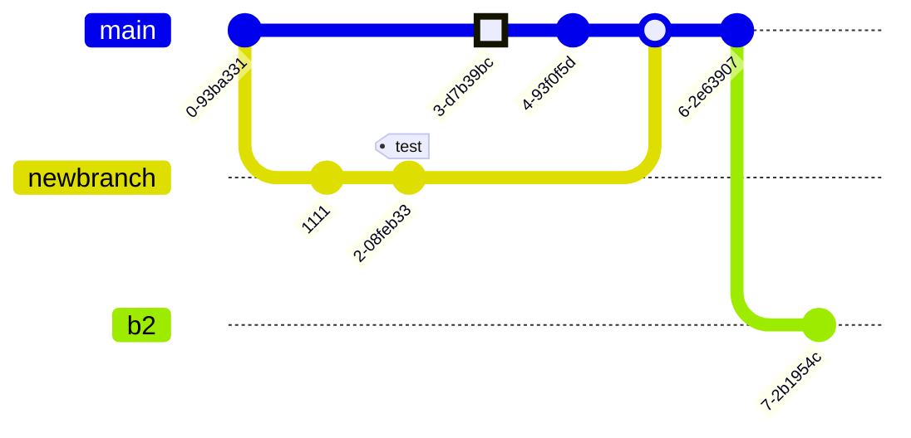

---
hide:
  - navigation
---

# Kitchen Sink

## Abbreviations

This template comes with a lot of built-in abbreviations. To use them just type an abbreviation, and it will be
annotated.

* WCAG
* NaN
* W3C

If an abbreviation is missing, just add it to the `snippets/abbreviations.md` file.

!!! warning "Only in production!"

    The abbreviations will only render when you run `make build`, they do not show with `make dev`.


## Keyboard Shortcuts

You can include keyboard shortcuts in your documentation using the following formatting.

> To copy, press ++ctrl+c++ or ++cmd+c++

```
To copy, press ++ctrl+c++ or ++cmd+c++
```

## Definition lists

Definition lists or `dl` tags, are useful anywhere you need a list of key-value pairs.

`Lorem ipsum dolor sit amet`

:   Sed sagittis eleifend rutrum. Donec vitae suscipit est. Nullam tempus
tellus non sem sollicitudin, quis rutrum leo facilisis.


`Cras arcu libero`

:   Aliquam metus eros, pretium sed nulla venenatis, faucibus auctor ex. Proin
ut eros sed sapien ullamcorper consequat. Nunc ligula ante.

    Duis mollis est eget nibh volutpat, fermentum aliquet dui mollis.
    Nam vulputate tincidunt fringilla.
    Nullam dignissim ultrices urna non auctor.

## Tables

Normal Markdown tables, nothing new here.

| Method   | Description                          |
|:---------|:-------------------------------------|
| `GET`    | :material-check:     Fetch resource  |
| `PUT`    | :material-check-all: Update resource |
| `DELETE` | :material-close:     Delete resource |


## Math and Latex

You can use the [MathJax](https://www.mathjax.org/) library to display both inline and centred equations, or formatted
text.

### Inline

```
Albert Einstein’s famous energy-mass equation, $E = mc^ 2$ is one of the greatest marvels of this universe.
```

Albert Einstein’s famous energy-mass equation, $E = mc^ 2$ is one of the greatest marvels of this universe.

### Centred

```
Albert Einstein’s famous energy-mass equation, is one of the greatest marvels of this universe.

$$
E = mc^ 2
$$
```

Albert Einstein’s famous energy-mass equation, is one of the greatest marvels of this universe.

$$E = mc^ 2$$

## Icons and Emojis

To include icons and emoji, use the same syntax you would on slack.

For example, `:material-account-child-outline:` produces :material-account-child-outline:.

### Available Libraries

* [Material Design Icons](https://pictogrammers.com/library/mdi/) (prefix with `:material-`)
* [Font Awesome Icons](https://fontawesome.com/search?o=r&m=free) (prefix with `:fontawesome-`)
* [Octicons](https://primer.style/design/foundations/icons) (prefix with `:octicons-`)

## PlantUML Diagrams

PlantUML diagrams use the PlantUML web service to render diagrams. They support click to zoom, allowing more complex
diagrams. Take a look at [Architecture->Diagramming](architecture/diagramming.md) for a more thorough explainer on how
to use PlantUML diagrams for technical documentation.

```diagram-plantuml
@startuml
!include <C4/C4_Container>

Person(personAlias, "Label", "Optional Description")
Container(containerAlias, "Label", "Technology", "Optional Description")
System(systemAlias, "Label", "Optional Description")

System_Ext(extSystemAlias, "Label", "Optional Description")

Rel(personAlias, containerAlias, "Label", "Optional Technology")

Rel_U(systemAlias, extSystemAlias, "Label", "Optional Technology")
@enduml
```


## Basic Diagrams

Basic diagramming uses the [mermaid](https://mermaid.js.org/intro/) library. This template uses version 9.4.3 and does
not support click to zoom.

### Flowchart

[Documentation](https://github.com/mermaid-js/mermaid/blob/v9.4.3/docs/syntax/flowchart.md)


### Sequence Diagram

[Documentation](https://github.com/mermaid-js/mermaid/blob/v9.4.3/docs/syntax/sequenceDiagram.md)


### Class Diagram

[Documentation](https://github.com/mermaid-js/mermaid/blob/v9.4.3/docs/syntax/classDiagram.md)


### State Diagram

[Documentation](https://github.com/mermaid-js/mermaid/blob/v9.4.3/docs/syntax/stateDiagram.md)


### Entity Relationship

[Documentation](https://github.com/mermaid-js/mermaid/blob/v9.4.3/docs/syntax/entityRelationshipDiagram.md)


### User Journey

[Documentation](https://github.com/mermaid-js/mermaid/blob/v9.4.3/docs/syntax/userJourney.md)


### Gantt

[Documentation](https://github.com/mermaid-js/mermaid/blob/v9.4.3/docs/syntax/gantt.md)


### Pie Chart

[Documentation](https://github.com/mermaid-js/mermaid/blob/v9.4.3/docs/syntax/pie.md)


### Requirement

[Documentation](https://github.com/mermaid-js/mermaid/blob/v9.4.3/docs/syntax/requirementDiagram.md)


### Git Graph

[Documentation](https://github.com/mermaid-js/mermaid/blob/v9.4.3/docs/syntax/gitgraph.md)


