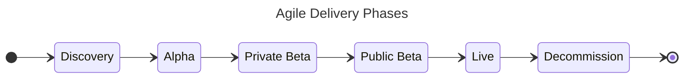

---
hide:
  - navigation
  - toc
---

# Playbooks

Here we document the approach taken to various delivery activities at CPS.

## Phases of Delivery

Broadly, an agile project will go through several phases. Each phase has a differing end goal involving several
iterations and will generally have a start and end date.

## Playbooks

[API Playbook](./API-Playbook){ .md-button .md-button--primary }
