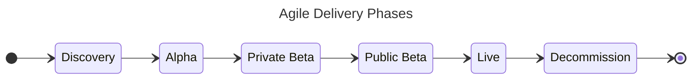

---
hide:
  - navigation
  - toc
---

# Playbooks

The Playbooks are a guide designd to help delivery teams create CPS' digital services more effectively and efficiently. This is a summary of what they cover

1. How to apply the GDS lifecycle phases
     * GDS Service Manual
     * Discovery
     * Alpha
     * Beta
     * (Continuous improvement in) Live
     * Retirement

2. How to get started as a Developer
    * What are the CPS Development Principles
    * What environment do I use for development, and how do I get one?
    * What development tools can I use?
    * What code repositories do I use and how do I get access
    * How do I get privileged access permissions
    * How do I manage infrastructure resources e.g. create, update and delete

3. What patterns should I reuse
    * How can I integrate with the CMS?
    * How do we monitor services
    * How do we manage secretes and certificates

4. How to apply the other engineering disciplines
    * How do we manage requirements
    * How do I extend the architecture and design a solution
    * How do I test the solution
    * How do we manage releases
    * How can I get assurance for a solution
    * How do we transition a solution into service

5. How do we apply the different delivery methodologies
    * Agile
    * Scaled Agile
    * Waterfall
    * How do most teams communicate and share knowledge

6. How do I participate in the CPS community of practice
    * Communication channels
    * Fora and events
    * Training and development pathways

## Phases of Delivery

Broadly, an agile project will go through several phases. Each phase has a differing end goal involving several
iterations and will generally have a start and end date.

## Playbooks

[API Playbook](./API-Playbook){ .md-button .md-button--primary }
